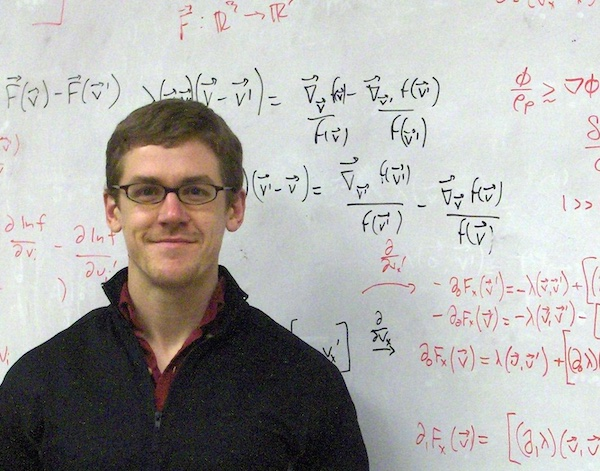
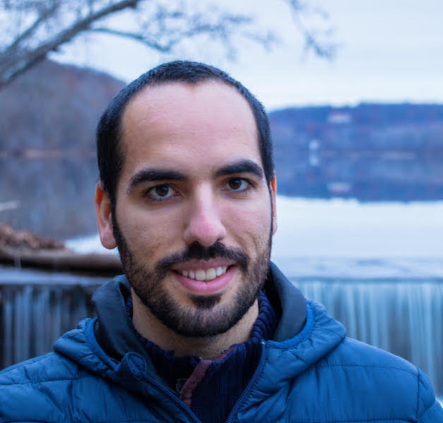
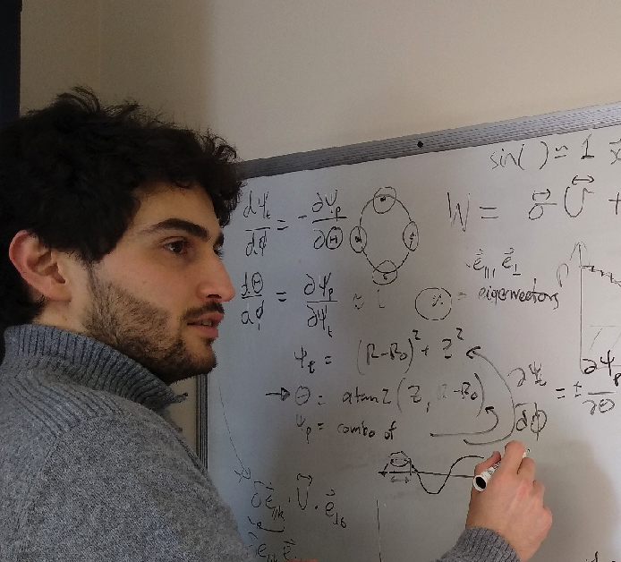
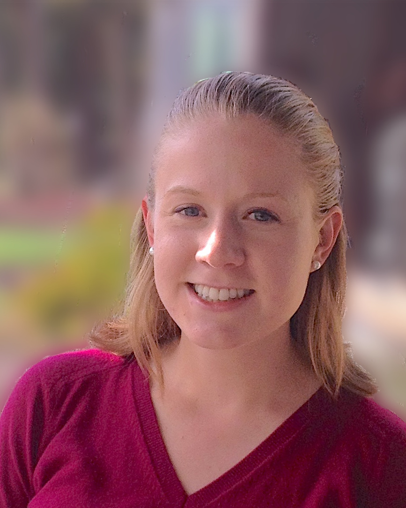

<table>

<tr><td>

<h4>Matt Landreman</h4>
Associate Research Scientist 
Room 3333 
<a href="https://goo.gl/maps/Zx1oqM59pTcoeQ6H9">
A. V. Williams building 
8223 Paint Branch Drive 
College Park, MD 20742, USA</a> 
Cell: (+1) 651-366-9306 
mattland at umd dot edu
</td></tr>

<tr><td>

<h4>Rogerio Jorge</h4>
Rogerio is a postdoctoral associate in the IREAP group at the University of Maryland and is a member of the Simons Collaboration on Hidden Symmetries and Fusion Energy. During his PhD work, he focused on the development of hybrid kinetic-fluid models able to describe plasma dynamics at arbitrary collisionalities. For his work, he obtained the Physics Doctoral Thesis Award at EPFL University. Currently, he is working on the development of mathematical tools to analytically describe magnetic equilibria of stellarators.
 
[<a href="https://web.ist.utl.pt/~rogerio.jorge/">Personal website</a>]
</td></tr>

<tr><td>

<h4>Alessandro Geraldini</h4>
I am a postdoc working on a method to directly compute the sensitivity (shape gradient) of the size of magnetic islands in a stellarator with respect to coils. To have a stellarator with good confinement, the size of magnetic islands must be minimized. To reduce tolerances on the positioning and assembly of coils, it is important to also minimize island sensitivity. My other area of research is the magnetic presheath. (Pre)sheaths are thin regions that form in plasma in direct contact with a solid surface. They are present at the edge of fusion devices, near probes, near spacecraft etc., and they determine how the plasma interacts with the surface.
</td></tr>

<tr><td>

<h4> Mike Martin</h4>
I am a PhD student working on transport in stellarators, including both turbulence and neoclassical impurity transport.
</td></tr>

<tr><td>

<h4>Elizabeth Paul</h4>
I am a PhD student working on adjoint methods for stellarator optimization and sensitivity analysis.
 
[<a href="https://terpconnect.umd.edu/~ejpaul/">Personal website</a>]
</td></tr>

</table>

#### Arthur Carlton-Jones
Undergraduate, working with Elizabeth Paul and Bill Dorland on adjoint methods for stellarator electromagnetic coils.

#### Patrick Kim
Undergraduate, working with Rogerio Jorge on magnetohydrodynamic stability near the magnetic axis of stellarators.

#### Collaborators at Maryland
On campus we work with 
[Bill Dorland](https://umdphysics.umd.edu/people/faculty/current/item/124-bdorland.html),
[Tom Antonsen](https://ece.umd.edu/clark/faculty/352/Thomas-M-Antonsen), 
[Ian Abel](https://ireap.umd.edu/faculty/abel), 
[Jim Drake](https://terpconnect.umd.edu/~drake/), 
[Adil Hassam](https://umdphysics.umd.edu/people/faculty/current/item/215-hassam.html), 
[Marc Swisdak](https://ireap.umd.edu/faculty/swisdak), 
[Lise-Marie Imbert-Gerard](https://home.cscamm.umd.edu/~lmig/), and 
[Ricardo Nochetto](https://www.math.umd.edu/~rhn/).

#### Past group members
Brian Reed, undergraduate  
Ben Cha, undergraduate

